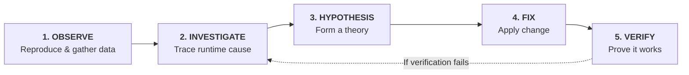

# Museum of Bugs 🪲

A hands-on workshop environment for **"Debugging the Web with AI Agents + Chrome DevTools"**.

> **"Stop describing bugs to agents. Give them access to the running system and let them investigate."**

---

## 🚀 Quick Start

### Prerequisites

- Node.js 18+
- npm 9+

### Install & Run

```bash
# Install all dependencies
npm run install:all

# Start both Vite client (:5173) and Express API (:3001)
npm run dev
```

Open [http://localhost:5173](http://localhost:5173)

---

## 🔁 The Investigation Loop

Every exercise in this workshop follows the 5-step diagnostic loop:



Skill instructions are available in:
`.agents/skills/investigation-loop/SKILL.md`

---

## 🎯 The 4 Workshop Exercises (+ Warm-Up)

| Exercise | Scenario | Diagnostic Focus |
| :--- | :--- | :--- |
| **Ex 0** | **Warm-Up: The Missing Specimen** | Environment setup · Network panel inspection |
| **Ex 1** | **The Wrong Diagnosis** | Avoiding static code traps · Network 500 error tracing |
| **Ex 2** | **The Phantom Save** | Optimistic UI vs failed persistence · Page reload verification |
| **Ex 3** | **Works on My Machine** | Mobile responsive emulation (390px) · DOM touch overlay inspection |
| **Ex 4** | **Final Boss: Double Ticket** | Network throttling (Slow 3G) · Concurrency race conditions |

See [WORKSHOP.md](./WORKSHOP.md) for full exercise descriptions.

---

## 📊 Running Evals

To run the automated evaluation suite:

```bash
node evals/run-evals.js
```
