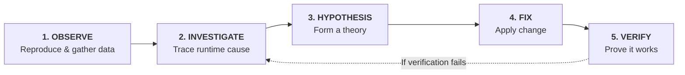

# Museum of Bugs: Workshop Guide 🪲

**"Debugging the Web with AI Agents + Chrome DevTools"**  
*Participant Guide*

---

## 💡 Core Workshop Rule

> **"Stop describing bugs to agents. Give them access to the running system and let them investigate."**

When debugging with AI coding agents, avoid pasting a bug description and hoping the model guesses the fix from static code. Instead, give the agent access to the live running browser session and prompt it to follow the **5-step Investigation Loop**.

---

## 🔁 The 5-Step Investigation Loop



| Step | Core Question | DevTools / Agent Action |
| :--- | :--- | :--- |
| **1. OBSERVE** | *What is actually happening?* | Reproduce the bug, take **Screenshots**, check **Console**, monitor **Network**, set **Device Viewport / Throttling**. |
| **2. INVESTIGATE** | *Where does it break at runtime?* | Inspect **failed HTTP response bodies**, **DOM bounding boxes**, **computed CSS rules**, **event listeners**, **stack traces**. |
| **3. HYPOTHESIS** | *Why is this happening?* | Connect runtime evidence to code; actively **rule out red herrings** and plausible false leads. |
| **4. FIX** | *What is the minimal targeted fix?* | Apply minimal, clean change to client or server code. |
| **5. VERIFY** | *Does it work under identical conditions?* | Re-run reproduction in browser under the **same mobile viewport, network throttling, or page reload** to capture proof. |

---

## 🛠️ Workshop Exercises

### Exercise 0 — Warm-Up: Setup & Connectivity (~5–7 min)
- **User Bug Report:**  
  > *"Something is wrong with this exhibit page. The Ant Colony exhibit card never displays its photograph. Investigate the running application using DevTools and fix it."*
- **Goal:** Verify that your agent + DevTools setup is connected and working.

---

### Exercise 1 — The Wrong Diagnosis (~20 min)
- **User Bug Report:**  
  > *"Searching for the 'Goliath Beetle' in the search bar fails with an error. Find the cause and fix it."*
- **Challenge:** Source-code inspection alone may suggest plausible but incorrect fixes. Let your agent inspect the runtime browser evidence to find the actual root cause.

---

### Exercise 2 — The Phantom Save (~25 min)
- **User Bug Report:**  
  > *"The UI says the curator notes were saved successfully, but after refreshing the page the old notes return. Find out why, fix it, and prove that the fix works."*
- **Challenge:** The UI displays an optimistic success state even though state persistence failed. Use Network inspection to locate the real issue.

---

### Exercise 3 — Works on My Machine (~20 min)
- **User Bug Report:**  
  > *"Visitors on mobile devices report they cannot click the 'Reserve Guided Specimen Tour' button. It works completely fine on desktop. Find the trigger and fix it."*
- **Challenge:** The bug only manifests under specific browser viewport conditions. Use responsive device emulation (`390px` mobile width) to inspect layout collisions.

---

### Exercise 4 — Final Boss: Double Ticket (~20–25 min)
- **User Bug Report:**  
  > *"Some visitors accidentally purchase duplicate tickets. Support says it happens mostly on mobile connections. We cannot reproduce it reliably on fast office network. Fix it."*
- **Challenge:** Reproduce the issue under **Network Throttling** (Slow 3G), identify the race condition, and implement a robust loading guard.

---

## 📊 Running Evals

To evaluate your fixes against the test suite:

```bash
node evals/run-evals.js
```
