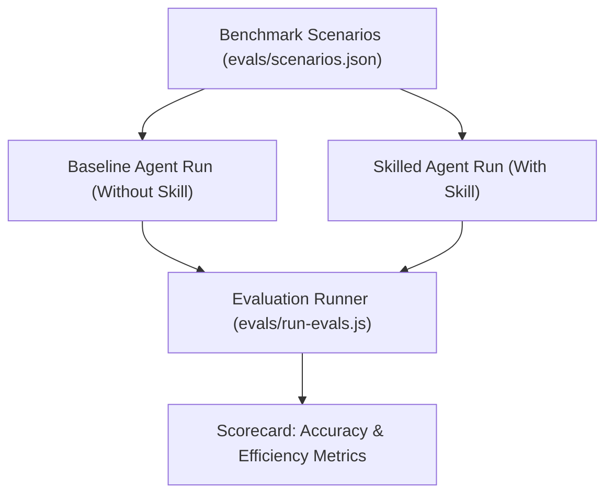

# Agent Skills & Evaluation Framework (Evals) 🧪

This directory contains the benchmark evaluation suite and guidance on **authoring and evaluating AI agent skills**.

---

## 🎯 What is an Agent Skill?

An **Agent Skill** is a structured markdown document (`SKILL.md`) located in `.agents/skills/<skill-name>/` that extends an AI agent's capabilities with specialized workflows, domain rituals, and tool protocols.

### Skill Anatomy

```
.agents/skills/investigation-loop/
├── SKILL.md              # Required: Main instructions with YAML frontmatter
└── references/           # Optional: Supporting cheatsheets, diagrams, examples
```

Example `SKILL.md`:
```markdown
---
name: investigation-loop
description: Enforce the 5-step Investigation Loop (Observe, Investigate, Hypothesis, Fix, Verify) for debugging web applications with Chrome DevTools.
---

# Investigation Loop

## Workflow Checklist
1. OBSERVE: Reproduce in live browser...
2. INVESTIGATE: Trace runtime error in Network/Console...
...
```

---

## 🛠️ How to Create Effective Agent Skills

When authoring a skill for your team or repository, follow these 4 design principles:

### 1. Identify Recurring Agent Failure Modes
Notice what agents get wrong when left unguided. For example:
- Guessing fixes from static code without looking at runtime errors.
- Trusting optimistic UI updates without verifying database/network persistence.
- Testing only on full-screen desktop and missing mobile viewport collisions.

### 2. Write Trigger-Focused Descriptions
The `description` field in the YAML frontmatter determines whether an agent triggers your skill. Use clear, verb-heavy descriptions:
- ✅ *"Use whenever diagnosing user bug reports, investigating UI/runtime issues, finding root causes, or testing fixes."*
- ❌ *"A skill about debugging."*

### 3. Provide Step-by-Step Action Protocols
Break the task down into sequential gates (e.g. `Observe → Investigate → Hypothesis → Fix → Verify`).

### 4. Enforce Explicit Proof & Anti-Patterns
Specify negative constraints (what NOT to do) and required verification proof:
- *"NEVER edit code before reproducing the error in the browser."*
- *"A task is NOT done until verified under matching viewport/throttling conditions."*

---

## 📊 How to Evaluate Agent Skills with Evals

Evaluating skills replaces **"vibe-checking"** with **quantifiable benchmarks**.

### The Evaluation Workflow:



### 1. Defining Evaluation Scenarios (`scenarios.json`)
Each eval scenario tests a realistic user challenge with known pitfalls:
- `bugReport`: The user prompt.
- `staticTrap`: The red herring that static code analysis falls for.
- `requiredDevTools`: The DevTools capability needed to discover reality.
- `runtimeEvidence`: The definitive proof provided by the browser.
- `acceptanceCriteria`: Objective conditions for success.

### 2. Core Evaluation Metrics
- **First-Attempt Fix Rate (%)**: Did the agent resolve the root cause on the first try without guessing?
- **Red-Herring Resistance Rate (%)**: Did the agent avoid false leads in static code?
- **Runtime Verification Compliance (%)**: Did the agent prove the fix in the running environment?
- **Tool Turn Efficiency**: Number of tool actions taken to reach verified resolution.

### 3. Running Evals
Execute the benchmark suite:
```bash
node evals/run-evals.js
```
